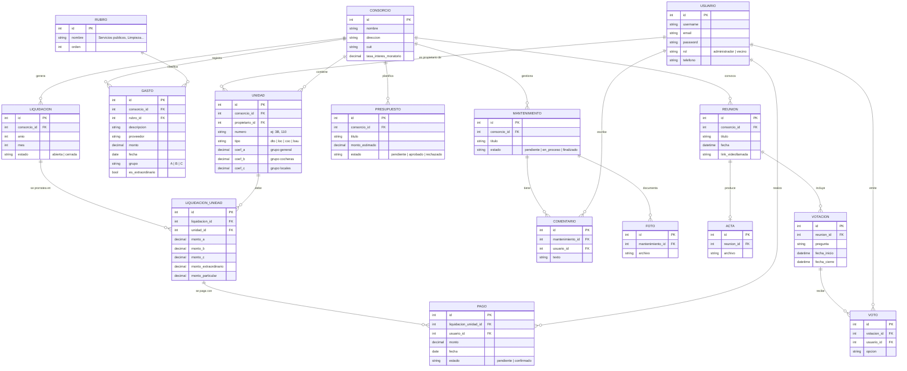

#  📘 Proyecto: Aplicación de Gestión de Consorcios

## 👥 Tutora:
Sofia Raia

## 👥 Equipo 188
Laura Diaco
Matias Mansilla

# 🏢 Consorcio360

Plataforma web para la **gestión integral de consorcios**: centraliza la administración económica, el seguimiento de mantenimientos y la comunicación entre administradores y vecinos.

## 📋 El problema

En la mayoría de los consorcios, la información sobre gastos, reparaciones, reuniones y decisiones está distribuida entre Excel, WhatsApp, papeles y memoria de las personas. Esto dificulta la administración y le niega al vecino acceso claro a la información de su unidad.

**Consorcio360** resuelve esto con una plataforma única donde:

- El **administrador** gestiona el consorcio, unidades, gastos, liquidaciones, mantenimientos, reuniones y votaciones.
- El **vecino** consulta su liquidación, su estado de cuenta, los mantenimientos y participa en las votaciones.

## 🛠️ Stack tecnológico

| Área | Tecnología | Versión | ¿Para qué la usamos? |
|---|---|---|---|
| Lenguaje backend | Python | 3.12 | Lógica de negocio del servidor |
| Framework backend | Django | 5.x | Estructura del proyecto, ORM y autenticación |
| API REST | Django REST Framework | 3.x | Comunicación entre frontend y backend |
| Autenticación | SimpleJWT | — | Login con tokens (sesiones seguras) |
| Lenguaje frontend | TypeScript | 5.x | JavaScript con tipos (menos errores) |
| Framework frontend | React | 18.x | Interfaz de usuario interactiva |
| Build tool | Vite | 5.x | Servidor de desarrollo y compilado del frontend |
| Estilos | Tailwind CSS | 3.x | Diseño responsive profesional y rápido |
| Base de datos | PostgreSQL | 16 | Persistencia de datos relacionales |
| Broker de tareas | Redis | 7 | Backend de tareas programadas |
| Tareas programadas | Celery | 5.x | Jobs automáticos (ej: generar liquidaciones mensuales) |
| Almacenamiento archivos | MinIO (S3) | — | Fotos, actas, comprobantes |
| Entorno | Docker + Docker Compose | — | Base de datos y servicios sin instalar nada |
| Control de versiones | Git + GitHub | — | Respaldo del código y trabajo en equipo |
| Testing | Pytest | — | Pruebas automáticas del backend |
| Deploy | Render | — | Servidor en la nube (acceso público) |

## 🏗️ Arquitectura general

```
┌─────────────┐        HTTP/JSON         ┌──────────────┐        SQL        ┌──────────────┐
│   React      │  ──────────────────────▶ │   Django      │ ───────────────▶ │  PostgreSQL  │
│  (navegador) │   el navegador pide y    │  + DRF (API)  │  Django ORM      │  (los datos) │
│              │   el servidor responde   │               │  guarda/consulta │              │
└─────────────┘                          └──────┬───────┘                  └──────────────┘
                                                │
                                          ┌─────▼──────┐
                                          │    MinIO    │  ← archivos (fotos, actas, comprobantes)
                                          └────────────┘
```

**Explicación simple:** el navegador (React) es la "cara" de la app; Django es el "cerebro" que aplica las reglas de negocio (prorrateo, permisos); PostgreSQL es la "memoria" donde se guarda todo; MinIO es el "archivero" de documentos.

## 🗄️ Modelo de datos (esquema relacional)

El diseño se basó en documentación real de administración de consorcios (estado de cuentas y prorrateo, gastos por rubro), lo que motivó los **grupos de prorrateo A/B/C** (los gastos del grupo A los pagan todas las unidades, los del grupo B solo las cocheras, etc.) y los **rubros de gastos** (servicios públicos, limpieza, administración...).



**Notas de diseño:**

- **Grupos de prorrateo (A/B/C):** inspirado en estados de cuenta reales. Cada unidad tiene hasta 3 coeficientes; cada gasto se etiqueta con el grupo que lo paga. Así, la reparación del portón del garage se prorratea solo entre cocheras (grupo B) y la limpieza del hall entre todos (grupo A).
- **Saldo deudor no se guarda, se calcula:** el estado de cuenta de cada vecino se deriva en todo momento de `Σ liquidaciones vencidas − Σ pagos confirmados`, más interés moratorio según la tasa del consorcio. Esto evita datos desactualizados.
- **unique_together:** reglas de integridad (no puede haber dos unidades "3B" en el mismo consorcio; un vecino no puede votar dos veces en la misma votación).

## 🧩 Módulos del sistema (apps de Django)

| Módulo | Responsabilidad |
|---|---|
| `usuarios` | Registro, login JWT, roles (administrador / vecino) y perfiles |
| `consorcios` | Alta de consorcios, unidades habitacionales, tipos y coeficientes de prorrateo |
| `economia` | Rubros, gastos, liquidaciones mensuales, prorrateo por coeficientes, pagos y presupuestos |
| `mantenimientos` | Tareas con semáforo de estados, fotos y comentarios de seguimiento |
| `reuniones` | Reuniones virtuales, actas, votaciones y registro de votos |

## 🗺️ Roadmap de desarrollo

| Semanas | Entrega | Contenido |
|---|---|---|
| 1–2 | 🧱 Base del sistema | Modelo de datos, usuarios, roles, consorcios, unidades, PostgreSQL (Docker) |
| 3–4 | ⚙️ Backend | API REST, login, gastos, liquidaciones, prorrateo, pagos, mantenimientos básicos |
| 5–6 | 🎨 Frontend | React + TypeScript, paneles de administrador y vecino |
| 7 | 🔗 Integración | Frontend + API + PostgreSQL, validaciones, pruebas de permisos |
| 8 | 🚀 MVP completo | Presupuestos, reuniones, actas, votaciones, Celery, MinIO |
| 9 | ✅ Entrega final | Pruebas, documentación, deploy en Render |

## ▶️ Cómo levantar el proyecto

Requisitos: Git, Python 3.12 y Docker Desktop instalados.

```bash
# 1. Clonar el repositorio
git clone https://github.com/TU_USUARIO/consorcio360.git
cd consorcio360

# 2. Crear y activar el entorno virtual
python -m venv venv
venv\Scripts\activate        # en Windows
# source venv/bin/activate   # en Linux/Mac

# 3. Instalar dependencias
pip install -r requirements.txt

# 4. Levantar PostgreSQL, Redis y MinIO con Docker
docker compose up -d

# 5. Crear las tablas en la base de datos
python manage.py migrate

# 6. Crear un usuario administrador
python manage.py createsuperuser

# 7. Levantar el servidor
python manage.py runserver
```

- Panel de administración: http://127.0.0.1:8000/admin
- API (cuando esté desarrollada): http://127.0.0.1:8000/api/
- MinIO (archivos): http://127.0.0.1:9001 (usuario: `consorcioadmin` / pass: `consorcioadmin123`)

## 📌 Estado actual

- ✅ Repositorio creado con README documentado
- ✅ Stack tecnológico definido y justificado
- ✅ Esquema de base de datos diseñado (diagrama ER)
- ✅ Entorno con Docker (PostgreSQL 16, Redis 7, MinIO)
- ✅ Estructura inicial de Django con módulos (`usuarios`, `consorcios`, `economia`, `mantenimientos`, `reuniones`)
- ✅ Modelos de Usuario, Consorcio y Unidad implementados y migrados
- ✅ Panel de administración funcional (alta de consorcios y unidades)
- ⬜ Modelos de economía, mantenimientos y reuniones (próxima etapa)
- ⬜ API REST y lógica de prorrateo
- ⬜ Frontend React

---

*Proyecto integrador académico — gestión integral de consorcios.*
