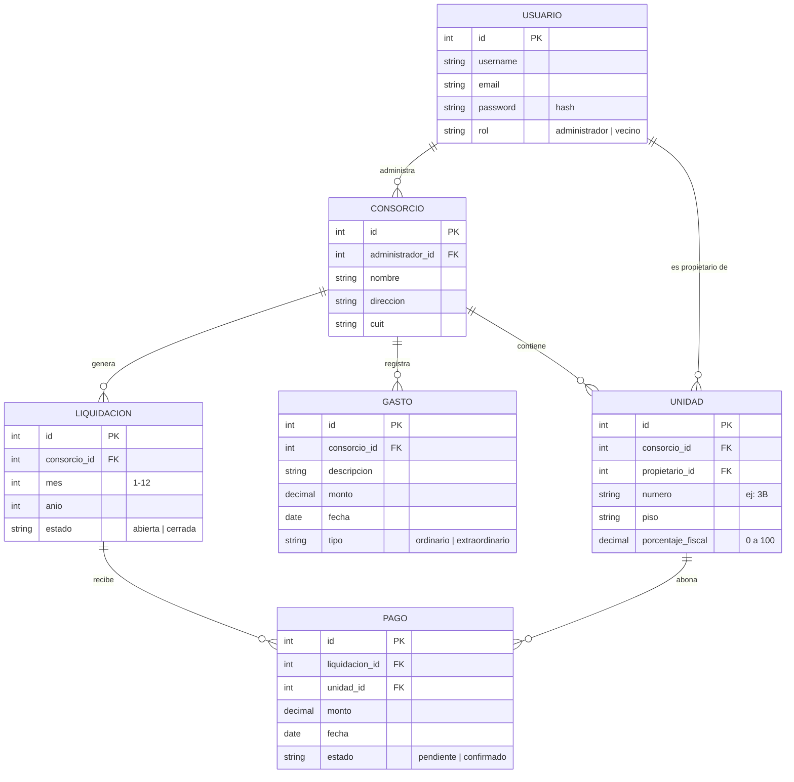

# 🏢 Consorcio360

Aplicación web para la gestión básica de consorcios. El sistema centraliza la información de unidades, gastos, liquidaciones y pagos, facilitando el trabajo del administrador y la consulta de los vecinos.

## 🎯 Objetivo

Desarrollar una primera versión funcional que permita cubrir el flujo principal de gestión de un consorcio:

**Configurar consorcio → cargar unidades → registrar gastos → generar liquidación (prorrateo por porcentaje fiscal) → registrar pagos simulados → consultar estado de cuenta.**

El alcance se mantiene deliberadamente acotado para garantizar un desarrollo completo y probado, con apertura clara a mejoras futuras (mantenimientos, reuniones, votaciones, archivos en S3, tareas automáticas).

---

## 🛠️ Stack tecnológico

### Backend
- **Python 3.12** — lenguaje principal.
- **Django 5.x** — framework MVC: ORM, autenticación, panel de administración.
- **Django REST Framework** — API REST para la comunicación frontend ↔ backend.
- **SimpleJWT** — autenticación con tokens JWT (sesiones seguras y stateless).

### Frontend
- **React 18** — interfaz de usuario (SPA).
- **Vite** — servidor de desarrollo y build del frontend.
- **CSS tradicional** — estilos propios, sin frameworks, para mantener el desarrollo simple y transparente.

### Base de datos
- **PostgreSQL 16** — base relacional (port `5432`).
- **Docker Compose** *(opcional)* — levanta PostgreSQL con un comando sin instalarlo en el sistema.

### Pruebas
- **Pytest + pytest-django** — tests unitarios del backend (reglas de prorrateo, permisos).

### Versionado y deploy
- **Git + GitHub** — repositorio con historial de cambios.
- **Render** — deploy del backend y la base de datos en la nube.

> **Criterio de selección:** se priorizó un stack conocido, maduro y de bajo "costo de configuración". Django entrega de fábrica autenticación segura, ORM y panel de administración, lo que permite dedicar el tiempo del proyecto a la lógica de negocio del dominio (prorrateo, liquidaciones, pagos) en lugar de a infraestructura.

---

## 🗄️ Diseño de la base de datos

Base relacional en PostgreSQL. Un único modelo de **Usuario** con campo `rol` (administrador/vecino), lo que evita duplicar nombre, email y contraseña en dos tablas (normalización) y simplifica la autenticación.



### Reglas de negocio modeladas

- Un administrador gestiona muchos consorcios; un consorcio tiene muchas unidades, gastos y liquidaciones.
- Una unidad pertenece a **un** consorcio y tiene **un** propietario (un propietario puede tener varias unidades).
- No puede haber dos liquidaciones del mismo consorcio para el mismo mes/año (`unique_together`).
- El **prorrateo** es una operación calculada (no se guarda): `monto_unidad = total_gastos_del_periodo × porcentaje_fiscal / 100`. Esto garantiza que el valor siempre sea consistente con los gastos cargados.
- Un **pago simulado** nace `pendiente` y el administrador lo `confirma` (flujo similar a la acreditación bancaria real).

---

## 🧩 Módulos del sistema

| Módulo (app Django) | Responsabilidad |
|---|---|
| `usuarios` | Login, registro y roles (administrador / vecino) |
| `consorcios` | Alta del consorcio, unidades y porcentaje fiscal |
| `economia` | Gastos, liquidaciones mensuales, prorrateo y pagos simulados |

## 🗺️ Roadmap

| Etapa | Contenido | Estado |
|---|---|---|
| 1. Diseño y base | Stack, modelo de datos, estructura Django, PostgreSQL | 🔵 En curso |
| 2. Backend | API REST, JWT, CRUD de consorcios/unidades/gastos | ⬜ |
| 3. Lógica económica | Generación de liquidaciones + prorrateo + tests | ⬜ |
| 4. Frontend | React: login, panel admin, panel vecino, estado de cuenta | ⬜ |
| 5. Integración y pagos | Pagos simulados, validaciones, manejo de errores | ⬜ |
| 6. Cierre | Pruebas, deploy en Render, documentación final | ⬜ |

**Mejoras futuras (fuera del MVP):** mantenimientos con fotos y comentarios, reuniones virtuales, actas, votaciones, presupuestos, rubros de gastos y prorrateo por grupos (coeficientes A/B/C), intereses moratorios, notificaciones automáticas, Celery + Redis, almacenamiento S3/MinIO, pagos reales.

---

## ▶️ Cómo ejecutar el proyecto

Requisitos: Python 3.12 y Git. (Opcional: Docker Desktop para PostgreSQL).

```bash
# 1. Clonar
https://github.com/LauraDiaco365/TrabajoFinalIntegrador-AppConsorcio.git
cd consorcio360

# 2. Entorno virtual
python -m venv venv
venv\Scripts\activate          # Windows
# source venv/bin/activate     # Linux/Mac

# 3. Dependencias
pip install -r requirements.txt

# 4. Base de datos (opción A: con Docker)
docker compose up -d
# (opción B: sin Docker, usar SQLite -> ver nota en settings.py)

# 5. Crear tablas y superusuario
python manage.py migrate
python manage.py createsuperuser

# 6. Levantar servidor
python manage.py runserver
```

## Demo en el panel de administración

Después de levantar el servidor (`python manage.py runserver`), entrar a:

`http://127.0.0.1:8000/admin`

### Pasos de la demo
1. Iniciar sesión con el superusuario creado.
2. Crear **usuario vecino** de prueba
3. Cargar un **Consorcio** de prueba 
3. Agregar **2 Unidades** dentro de ese consorcio creado con porcentajes fiscales que sumen 100% (las unidades pueden estar asignadas al mismo vecino de prueba)
4. Registrar **1 Gasto** (ejemplo: Luz $10.000).
5. Crear la **Liquidación** del mes correspondiente.

### Resultado esperado
En el listado de liquidaciones se muestran:
- El **monto_total** calculado automáticamente (ejemplo: $10.000).
- El **prorrateo por unidad**, donde cada unidad aparece con el monto que le corresponde (ejemplo: `1A: 5000.00, 1B: 5000.00`).

Esto confirma que el cálculo de prorrateo funciona correctamente tanto en los tests como en la interfaz del admin.


## 🧪 Tests de la app *economia*

El archivo `tests.py` de la app **economia** comprueba que el cálculo del prorrateo funciona correctamente.  
Ejemplo: un gasto de $10.000 se reparte 50/50 entre dos unidades, resultando $5.000 para cada una.

### Cómo ejecutarlo
Desde la carpeta donde está `manage.py`:

```bash
python manage.py test economia


## 📌 Estado actual

- ✅ Stack definido y justificado
- ✅ Esquema de base de datos diseñado (diagrama ER)
- ✅ Modelos implementados (Usuario, Consorcio, Unidad, Gasto, Liquidación, Pago)
- ⬜ API REST y autenticación JWT
- ⬜ Frontend React
- ⬜ Deploy


