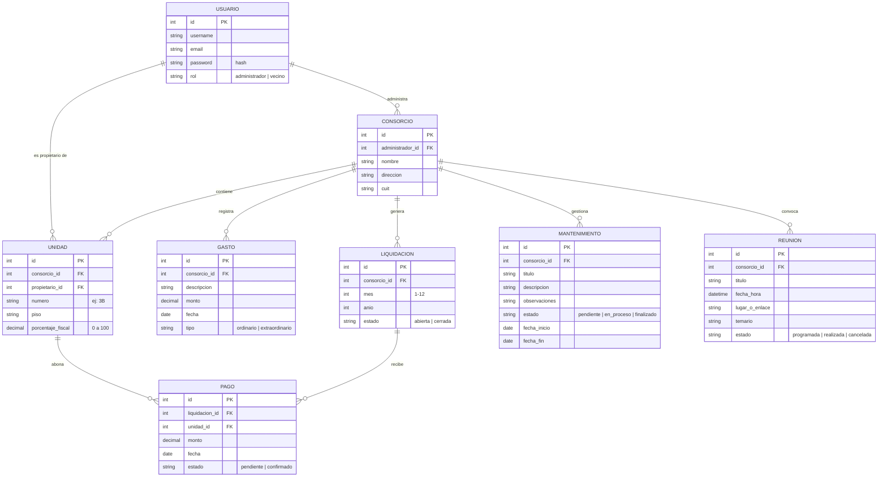

# 🏢 Consorcio360

**Consorcio360** es una aplicación web diseñada para la gestión integral y transparente de consorcios. La plataforma centraliza la administración económica, el seguimiento operativo de mantenimientos y la comunicación entre administradores y vecinos.

---

## 🎯 Objetivo y Circuito del Sistema

El objetivo del proyecto es desarrollar un sistema funcional que cubra el flujo completo de la vida cotidiana de un consorcio.

### 🔄 Circuito principal que posibilita la aplicación:

**1. Configuración del Consorcio:** Alta del consorcio, registro de unidades habitacionales y asignación del porcentaje fiscal correspondiente a cada unidad.

**2. Gestión Económica:** Registro de gastos ordinarios y extraordinarios, generación de liquidaciones mensuales, cálculo automático del prorrateo según el porcentaje fiscal y emisión de estados de cuenta.

**3. Registros de Pago:** Posibilidad de que los vecinos registren sus pagos simulados y el administrador los confirme o valide.

**4. Seguimiento de Mantenimientos:** Registro de trabajos edilicios o reparaciones con un semáforo de seguimiento (`pendiente`, `en_proceso`, `finalizado`) y observaciones del estado de las obras.

**5. Convocatoria a Reuniones:** Creación de convocatorias a asambleas o reuniones de consorcio con fecha, hora, lugar o enlace y temario de los puntos a tratar.

---

## 📌 Decisión de Alcance y Registro de Cambios

Para garantizar la claridad del proyecto y responder punto por punto a las devoluciones de la tutora, documentamos las siguientes decisiones:

### 📩 Ajustes de la 1.ª Entrega
* **Ajuste del Stack Tecnológico:** A partir de las observaciones de la primera entrega, simplificamos la arquitectura y dejamos fuera de esta etapa inicial tecnologías complejas como Celery, Redis, almacenamiento en MinIO/S3 y TypeScript. Decidimos enfocarnos en un MVP sólido y funcional basado en **Python 3.12, Django 5.x, Django REST Framework, React 18 y PostgreSQL 16**.

### 📩 Ajustes de la 2.ª Entrega
* **Unificación del Alcance:** Definimos este `README.md` como el **único documento de alcance vigente**. Para evitar contradicciones, el borrador inicial (`README_anterior.md`) fue movido a la carpeta `docs/historial/` únicamente como registro histórico del proyecto.
* **Inclusión de los Módulos (`mantenimientos` y `reunions`):** En respuesta al señalamiento sobre las apps que ya estaban creadas en el repositorio, confirmamos que **ambas se mantienen dentro del alcance del proyecto**. En esta entrega sumamos sus entidades y reglas de negocio al diseño conceptual y al Diagrama ER, pausando el desarrollo de código hasta que la documentación técnica esté aprobada.
* **Higiene del Repositorio (`.gitignore`):** Agregamos un archivo `.gitignore` para proyectos Django y React, y quitamos del seguimiento de Git la carpeta del entorno virtual (`venv/`), los archivos de base de datos local (`*.sqlite3`) y las carpetas de caché (`__pycache__/`).
* **Respeto al Proceso de Diseño:** Tomamos en cuenta la indicación de validar el diseño antes de programar, por lo que no avanzaremos con nueva lógica en código (backend o frontend) hasta contar con la aprobación formal de esta entrega.

---
## 🛠️ Stack tecnológico

### Backend
- **Python 3.12** — lenguaje principal.
- **Django 5.x** — framework MVC: ORM, autenticación, panel de administración.
- **Django REST Framework** — API REST para la comunicación frontend ↔ backend.
- **SimpleJWT** — autenticación con tokens JWT (sesiones seguras y stateless).

### Frontend
- **React 18** — interfaz de usuario (SPA).
- **Vite** — servidor de desarrollo y build del frontend.
- **CSS tradicional** — estilos propios, sin frameworks, para mantener el desarrollo simple y transparente.

### Base de datos
- **PostgreSQL 16** — base relacional (port `5432`).
- **Docker Compose** *(opcional)* — levanta PostgreSQL con un comando sin instalarlo en el sistema.

### Pruebas
- **Pytest + pytest-django** — tests unitarios del backend (reglas de prorrateo, permisos).

### Versionado y deploy
- **Git + GitHub** — repositorio con historial de cambios.
- **Render** — deploy del backend y la base de datos en la nube.

> **Criterio de selección:** se priorizó un stack conocido, maduro y de bajo "costo de configuración". Django entrega de fábrica autenticación segura, ORM y panel de administración, lo que permite dedicar el tiempo del proyecto a la lógica de negocio del dominio (prorrateo, liquidaciones, pagos) en lugar de a infraestructura.

---
## 📁 Estructura del Repositorio

El proyecto mantiene una organización clara dividiendo la documentación, la base de datos, el backend y el frontend:

```text
TrabajoFinalIntegrador-AppConsorcio/
├── assets/                           # Imágenes y recursos estáticos del proyecto (logos, etc.)
├── backend/                          # Aplicaciones de Django (usuarios, consorcios, economia, mantenimientos, reunions)
├── config/                           # Configuración global del proyecto Django (settings, urls, wsgi)
├── database/                         # Scripts DDL/DML y esquemas de la base de datos
├── docs/                             # Documentación técnica del proyecto
│   ├── decisiones_de_diseno.md       # Decisiones de arquitectura, changelog y reglas de negocio
│   └── historial/                    # Registro histórico
│       └── README_anterior.md
├── frontend/                         # Proyecto React (Interfaz de usuario)
├── .gitignore                        # Archivos excluidos del versionado de Git
├── docker-compose.yml                # Configuración de contenedor PostgreSQL
├── README.md                         # Documentación principal del repositorio
└── requirements.txt                  # Dependencias del proyecto Python

---

## 🗄️ Diseño de la base de datos

Base relacional en PostgreSQL. Un único modelo de **Usuario** con campo `rol` (administrador/vecino), lo que evita duplicar nombre, email y contraseña en dos tablas (normalización) y simplifica la autenticación.


```mermaid
erDiagram
    USUARIO ||--o{ CONSORCIO : "administra"
    CONSORCIO ||--o{ UNIDAD : "contiene"
    USUARIO ||--o{ UNIDAD : "es propietario de"
    CONSORCIO ||--o{ GASTO : "registra"
    CONSORCIO ||--o{ LIQUIDACION : "genera"
    LIQUIDACION ||--o{ PAGO : "recibe"
    UNIDAD ||--o{ PAGO : "abona"
    CONSORCIO ||--o{ MANTENIMIENTO : "gestiona"
    CONSORCIO ||--o{ REUNION : "convoca"

    USUARIO {
        int id PK
        string username
        string email
        string password "hash"
        string rol "administrador | vecino"
    }
    CONSORCIO {
        int id PK
        int administrador_id FK
        string nombre
        string direccion
        string cuit
    }
    UNIDAD {
        int id PK
        int consorcio_id FK
        int propietario_id FK
        string numero "ej: 3B"
        string piso
        decimal porcentaje_fiscal "0 a 100"
    }
    GASTO {
        int id PK
        int consorcio_id FK
        string descripcion
        decimal monto
        date fecha
        string tipo "ordinario | extraordinario"
    }
    LIQUIDACION {
        int id PK
        int consorcio_id FK
        int mes "1-12"
        int anio
        string estado "abierta | cerrada"
    }
    PAGO {
        int id PK
        int liquidacion_id FK
        int unidad_id FK
        decimal monto
        date fecha
        string estado "pendiente | confirmado"
    }
    MANTENIMIENTO {
        int id PK
        int consorcio_id FK
        string titulo
        string descripcion
        string observaciones
        string estado "pendiente | en_proceso | finalizado"
        date fecha_inicio
        date fecha_fin
    }
    REUNION {
        int id PK
        int consorcio_id FK
        string titulo
        datetime fecha_hora
        string lugar_o_enlace
        string temario
        string estado "programada | realizada | cancelada"
    }
```

### Reglas de Negocio Modeladas

* **Consorcio y Unidades:** Un **Administrador** gestiona uno o varios consorcios. Cada consorcio agrupa sus respectivas unidades habitacionales, las cuales tienen asignado un vecino propietario y un porcentaje fiscal.
* **Gestión Económica:** El **Administrador** registra los gastos ordinarios y extraordinarios del consorcio y genera las liquidaciones mensuales.
* **Restricción de Unicidad (`unique_together`):** No se pueden generar dos liquidaciones para el mismo consorcio en el mismo mes y año.
* **Cálculo de Prorrateo:** Se calcula dinámicamente (`monto_unidad = total_gastos × porcentaje_fiscal / 100`). No se guarda en la base de datos para asegurar que los saldos siempre estén actualizados si se modifica o agrega un gasto.
* **Pagos Simulados:** El **Vecino** registra el pago de su liquidación, el cual nace en estado `pendiente` hasta que el **Administrador** lo revisa y confirma.
* **Mantenimientos:** El **Administrador** registra los trabajos edilicios o reparaciones del consorcio, actualizando sus observaciones y el semáforo de seguimiento (`pendiente`, `en_proceso`, `finalizado`) para dar visibilidad a los vecinos.
* **Reuniones:** El **Administrador** crea y convoca las reuniones o asambleas del consorcio, estableciendo fecha, hora, lugar o enlace de acceso y el temario con los puntos a tratar.

---

## 🧩 Módulos del Sistema

| Módulo (app Django) | Responsabilidad | Estado actual |
|---|---|---|
| `usuarios` | Login, registro y gestión de roles (Administrador / Vecino) | Diseñado / Código inicial validado |
| `consorcios` | Alta de consorcios, registro de unidades y porcentaje fiscal | Diseñado / Código inicial validado |
| `economia` | Gastos, liquidaciones mensuales, cálculo de prorrateo y pagos simulados | Diseñado / Código inicial validado |
| `mantenimientos` | Registro de tareas edilicias, observaciones y semáforo de seguimiento | Diseñado (Pausado de codificación)[cite: 1] |
| `reunions` | Convocatoria a reuniones de consorcio, asignación de temario y canal | Diseñado (Pausado de codificación)[cite: 1] |

---

## 🗺️ Roadmap del Proyecto

| Etapa | Contenido | Estado |
|---|---|---|
| **1. Diseño y Base** | Stack, modelo ER (5 apps), arquitectura, `.gitignore` y documentación técnica | 🔵 En curso |
| **2. Backend API** | Endpoints REST, JWT, CRUD de consorcios, unidades y gastos | ⬜ |
| **3. Lógica Económica** | Liquidaciones, prorrateo verificado y registro de pagos simulados | ⬜ |
| **4. Mantenimientos y Reuniones** | Endpoints para estados de mantenimientos y convocatorias | ⬜ |
| **5. Frontend React** | Interfaz para administradores y vecinos (paneles, estados de cuenta, mantenimientos) | ⬜ |
| **6. Integración y Deploy** | Pruebas de integración, correcciones, deploy en Render y presentación final | ⬜ |

---

### 🚀 Mejoras Futuras (Fuera del MVP)

Las siguientes funcionalidades quedan identificadas como evolución de la plataforma para versiones posteriores:

* **Mantenimientos avanzados:** Adjuntos de fotos y módulo de comentarios de seguimiento por obra.
* **Asambleas y Actas:** Integración de reuniones virtuales, generación y firma de actas digitalizadas, y sistema de votaciones en línea.
* **Gestión Financiera Avanzada:** Elaboración de presupuestos, categorización por rubros de gastos, cálculo de prorrateo diferenciado por grupos (coeficientes A/B/C) e intereses moratorios automáticos.
* **Notificaciones y Automatización:** Envío de avisos automáticos por correo/WhatsApp mediante **Celery + Redis**.
* **Infraestructura y Servicios:** Almacenamiento de archivos y comprobantes en **MinIO / Amazon S3** e integración con pasarelas de **pagos reales**.

---

## 🧪 Verificación del Diseño y Pruebas Iniciales

> ⚠️ **Nota sobre el alcance de desarrollo:** Siguiendo las indicaciones de las entregas académicas, el código existente en el repositorio se utilizó únicamente como una **prueba de concepto para validar la viabilidad del diseño de datos** (especialmente el cálculo dinámico del prorrateo). El desarrollo formal de nuevos endpoints, la codificación de las apps `mantenimientos` y `reunions`, y el frontend en React se encuentran en pausa hasta la validación de esta documentación.

### ▶️ Instrucciones para levantar el entorno de validación

Requisitos: Python 3.12 y Git. (Opcional: Docker Desktop para PostgreSQL).

```bash
# 1. Clonar
https://github.com/LauraDiaco365/TrabajoFinalIntegrador-AppConsorcio.git
cd consorcio360

# 2. Entorno virtual
python -m venv venv
venv\Scripts\activate          # Windows
# source venv/bin/activate     # Linux/Mac

# 3. Dependencias
pip install -r requirements.txt

# 4. Base de datos (opción A: con Docker)
docker compose up -d
# (opción B: sin Docker, usar SQLite -> ver nota en settings.py)

# 5. Crear tablas y superusuario
python manage.py migrate
python manage.py createsuperuser

# 6. Levantar servidor
python manage.py runserver
```

## Demo en el panel de administración

Después de levantar el servidor (`python manage.py runserver`), entrar a:

`http://127.0.0.1:8000/admin`

### Pasos de la demo
1. Iniciar sesión con el superusuario creado.
2. Crear **usuario vecino** de prueba
3. Cargar un **Consorcio** de prueba 
3. Agregar **2 Unidades** dentro de ese consorcio creado con porcentajes fiscales que sumen 100% (las unidades pueden estar asignadas al mismo vecino de prueba)
4. Registrar **1 Gasto** (ejemplo: Luz $10.000).
5. Crear la **Liquidación** del mes correspondiente.

### Resultado esperado
En el listado de liquidaciones se muestran:
- El **monto_total** calculado automáticamente (ejemplo: $10.000).
- El **prorrateo por unidad**, donde cada unidad aparece con el monto que le corresponde (ejemplo: `1A: 5000.00, 1B: 5000.00`).

Esto confirma que el cálculo de prorrateo funciona correctamente tanto en los tests como en la interfaz del admin.


## 🧪 Tests de la app *economia*

El archivo `tests.py` de la app **economia** comprueba que el cálculo del prorrateo funciona correctamente.  
Ejemplo: un gasto de $10.000 se reparte 50/50 entre dos unidades, resultando $5.000 para cada una.

### Cómo ejecutarlo
Desde la carpeta donde está `manage.py`:

```bash
python manage.py test economia


## 📌 Estado actual

- ✅ **Stack tecnológico** redefinido y ajustado al alcance del MVP.
- ✅ **Esquema relacional (Diagrama ER)** diseñado e integrado para las 5 apps (usuarios, consorcios, economia, mantenimientos, reunions).
- ✅ **Modelos conceptuales y reglas de negocio** documentados detalladamente
- ✅**Higiene del repositorio**: Archivo .gitignore configurado y desacople de entornos virtuales y bases de datos locales.
- ⬜ **Desarrollo de API REST con Django REST Framework y JWT** (Pausado hasta aprobación).
- ⬜ **Desarrollo del Frontend en React + Vite** (Pausado hasta aprobación).
- ⬜ **Pruebas de integración final y Deploy en producción** (Pausado hasta aprobación)


